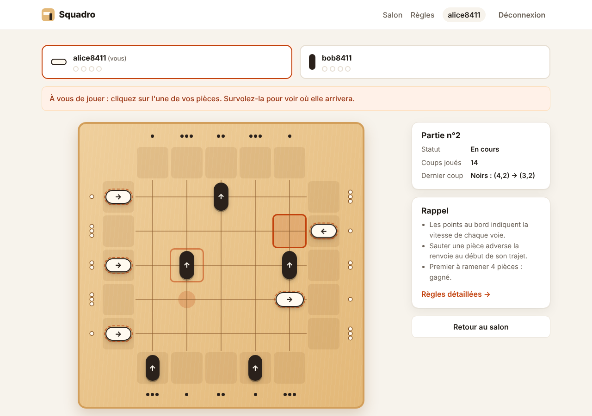
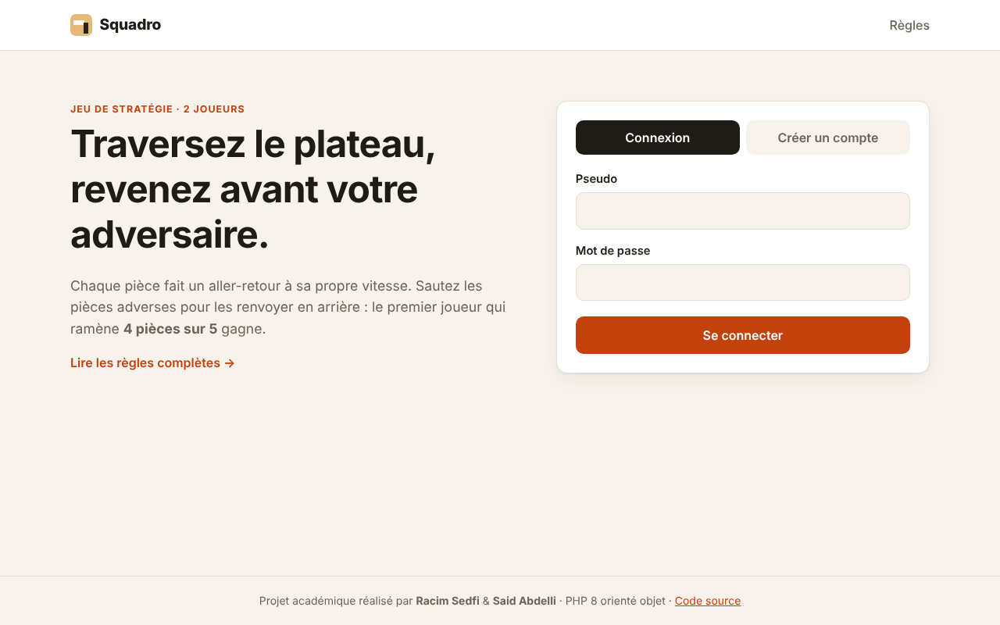
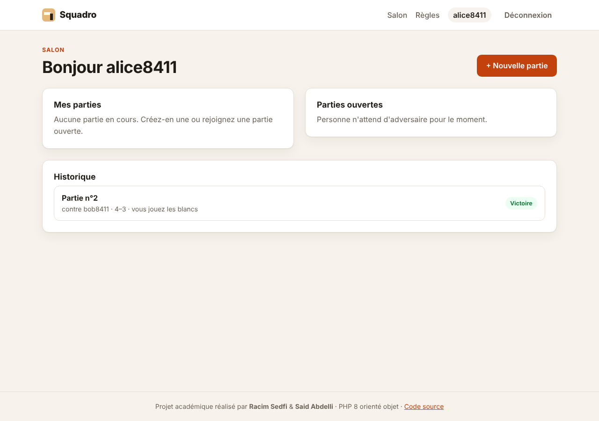
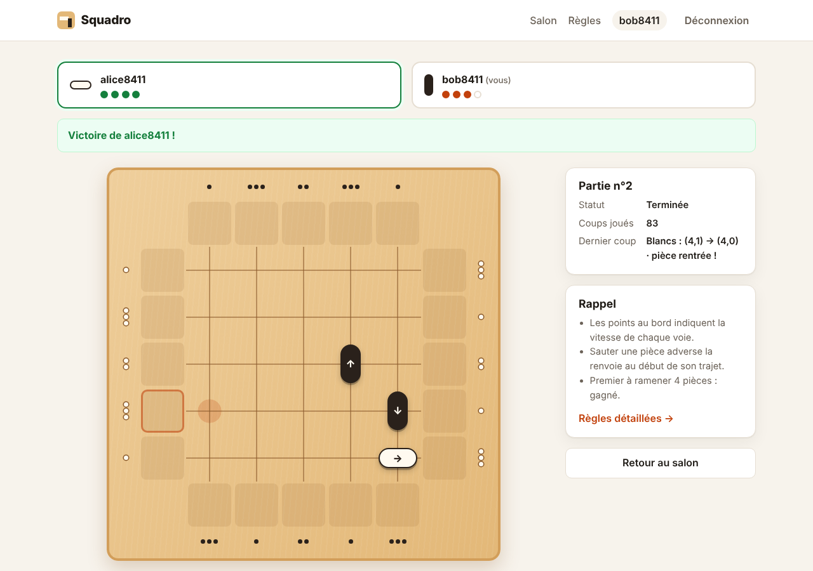

# Squadro — jeu de plateau multijoueur en PHP

[](https://github.com/Racim-sedfi/squadro-game/actions/workflows/ci.yml)


Application web pour jouer au **Squadro** à deux en ligne. Projet académique en **PHP 8 orienté objet sans framework** :
architecture MVC, moteur de règles testé, persistance PDO (MySQL ou SQLite) et Docker.



## Fonctionnalités

- Inscription / connexion (mots de passe hachés).
- Salon : créer, rejoindre ou reprendre une partie, historique des résultats.
- Plateau interactif avec aperçu du coup et mise à jour automatique au coup adverse.
- Règles officielles complètes, interface responsive.

| Connexion | Salon | Fin de partie |
|---|---|---|
|  |  |  |

## Démarrage

**Avec Docker** :

```bash
docker compose up --build
```

→ http://localhost:8080 (le schéma MySQL est créé automatiquement).

**Sans Docker** (PHP ≥ 8.2 avec `pdo_sqlite`, Composer) :

```bash
composer install
composer serve
```

→ http://localhost:8000 (base SQLite créée automatiquement). Configuration via `.env` (voir [`.env.example`](.env.example)).

## Structure

| Dossier | Contenu |
|---|---|
| `src/Modele` | Règles du jeu, indépendantes de HTTP et de la base |
| `src/Service` | Cas d'utilisation (authentification, parties) |
| `src/Persistance` | Dépôts PDO |
| `src/Http`, `src/Controleur` | Routeur, session/CSRF, contrôleurs |
| `templates/` | Vues PHP |
| `tests/` | Tests unitaires, d'intégration et fonctionnels |

**Sécurité** : requêtes préparées, CSRF, échappement XSS, état de partie en JSON (pas de `unserialize()`), verrouillage optimiste.

## Tests

```bash
composer test       # PHPUnit
composer analyse    # PHPStan niveau 8
```

## Règles du jeu

Chaque joueur doit faire traverser ses 5 pièces puis les ramener. On avance une pièce selon la vitesse de sa voie ;
une pièce qui saute des pièces adverses les renvoie au début de leur trajet. Le premier à ramener **4 pièces** gagne.

## Auteurs

- **Racim Sedfi** — [@Racim-sedfi](https://github.com/Racim-sedfi)
- **Said Abdelli**

*Squadro est un jeu édité par Gigamic. Projet pédagogique sans but commercial.*
